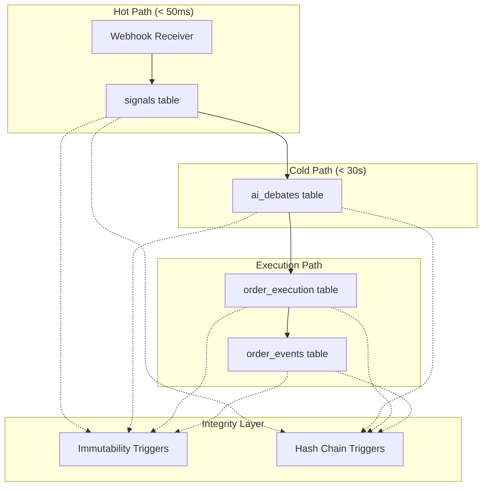

# Design Document: Immutable Audit Log Schema

## Overview

This design specifies the PostgreSQL schema and enforcement mechanisms for Project Autonomous Alpha's Immutable Audit Log. The schema provides Sovereign Tier data integrity through:

- **Append-only tables** with trigger-enforced immutability
- **DECIMAL(28,10)** precision for all financial values (zero floats)
- **SHA-256 chain of custody** linking each row to its predecessor
- **correlation_id** foreign keys enabling full trade decision traceability

The design targets PostgreSQL 15+ with pgcrypto extension for cryptographic hashing.

## Architecture



### Data Flow

1. **Signal Ingestion**: Webhook payload → `signals` table (correlation_id generated)
2. **AI Deliberation**: Model reasoning → `ai_debates` table (references correlation_id)
3. **Order Submission**: Trade action → `order_execution` table (references correlation_id)
4. **Order Events**: Fills/rejections → `order_events` table (references order_execution_id)

## Components and Interfaces

### Database Tables

| Table | Purpose | Key Columns |
|-------|---------|-------------|
| `signals` | Inbound webhook storage | correlation_id, signal_id, raw_payload |
| `ai_debates` | AI model reasoning | correlation_id, model_name, reasoning_json |
| `order_execution` | Trade submissions | correlation_id, order_type, symbol, quantity, price |
| `order_events` | Order lifecycle events | order_execution_id, event_type, fill_quantity, fill_price |

### Trigger Functions

| Function | Purpose | Error Code |
|----------|---------|------------|
| `validate_decimal_input()` | Ensures no precision loss from float casting | AUD-001 |
| `prevent_update()` | Blocks UPDATE on audit tables | AUD-002 to AUD-006 |
| `prevent_delete()` | Blocks DELETE on audit tables | AUD-003 to AUD-007 |
| `compute_row_hash()` | Generates SHA-256 chain hash, overwrites any user-provided value | N/A |
| `verify_chain_integrity()` | Validates hash chain | AUD-009 |

## Data Models

### signals Table

```sql
CREATE TABLE signals (
    id                  BIGSERIAL PRIMARY KEY,
    correlation_id      UUID NOT NULL DEFAULT gen_random_uuid() UNIQUE,
    signal_id           VARCHAR(64) NOT NULL UNIQUE,
    symbol              VARCHAR(20) NOT NULL,
    side                VARCHAR(10) NOT NULL CHECK (side IN ('BUY', 'SELL')),
    price               DECIMAL(28,10) NOT NULL,
    quantity            DECIMAL(28,10) NOT NULL,
    raw_payload         JSONB NOT NULL,
    source_ip           INET NOT NULL,
    hmac_verified       BOOLEAN NOT NULL DEFAULT FALSE,
    row_hash            CHAR(64) NOT NULL,
    created_at          TIMESTAMPTZ NOT NULL DEFAULT NOW()
);
```

### ai_debates Table

```sql
CREATE TABLE ai_debates (
    id                  BIGSERIAL PRIMARY KEY,
    correlation_id      UUID NOT NULL REFERENCES signals(correlation_id),
    model_name          VARCHAR(50) NOT NULL,
    reasoning_json      JSONB NOT NULL,
    confidence_score    DECIMAL(5,4) NOT NULL CHECK (confidence_score BETWEEN 0 AND 1),
    elapsed_ms          INTEGER NOT NULL,
    is_timeout          BOOLEAN NOT NULL DEFAULT FALSE,
    row_hash            CHAR(64) NOT NULL,
    created_at          TIMESTAMPTZ NOT NULL DEFAULT NOW()
);
```

### order_execution Table

```sql
CREATE TABLE order_execution (
    id                  BIGSERIAL PRIMARY KEY,
    correlation_id      UUID NOT NULL REFERENCES signals(correlation_id),
    order_type          VARCHAR(20) NOT NULL CHECK (order_type IN ('MARKET', 'LIMIT', 'STOP')),
    symbol              VARCHAR(20) NOT NULL,
    side                VARCHAR(10) NOT NULL CHECK (side IN ('BUY', 'SELL')),
    quantity            DECIMAL(28,10) NOT NULL,
    price               DECIMAL(28,10),
    exchange_order_id   VARCHAR(64),
    status              VARCHAR(20) NOT NULL,
    row_hash            CHAR(64) NOT NULL,
    created_at          TIMESTAMPTZ NOT NULL DEFAULT NOW()
);
```

### order_events Table

```sql
CREATE TABLE order_events (
    id                  BIGSERIAL PRIMARY KEY,
    order_execution_id  BIGINT NOT NULL REFERENCES order_execution(id),
    event_type          VARCHAR(30) NOT NULL CHECK (event_type IN ('FILL', 'PARTIAL_FILL', 'REJECTED', 'CANCELLED', 'KILL_SWITCH')),
    fill_quantity       DECIMAL(28,10),
    fill_price          DECIMAL(28,10),
    zar_equity          DECIMAL(28,2),
    positions_closed    JSONB,
    rejection_reason    TEXT,
    exchange_error_code VARCHAR(50),
    row_hash            CHAR(64) NOT NULL,
    created_at          TIMESTAMPTZ NOT NULL DEFAULT NOW()
);
```

### Genesis Hash Constant

```sql
-- Predefined genesis hash for chain initialization
-- SHA-256 of "SOVEREIGN_GENESIS_V1.3.2"
GENESIS_HASH = 'a1b2c3d4e5f6789012345678901234567890123456789012345678901234abcd'
```


## Correctness Properties

*A property is a characteristic or behavior that should hold true across all valid executions of a system-essentially, a formal statement about what the system should do. Properties serve as the bridge between human-readable specifications and machine-verifiable correctness guarantees.*

### Property 1: Unique Correlation ID Assignment
*For any* signal inserted into the signals table, the correlation_id SHALL be a valid UUID v4 that is unique across all existing records.
**Validates: Requirements 1.2**

### Property 2: Idempotency Enforcement
*For any* signal_id that already exists in the signals table, attempting to insert a duplicate SHALL be rejected by the database.
**Validates: Requirements 1.3**

### Property 3: Raw Payload Round-Trip
*For any* valid JSON payload stored in raw_payload, retrieving the value SHALL return byte-identical JSON to what was inserted.
**Validates: Requirements 1.5**

### Property 4: Immutability - UPDATE Rejection
*For any* record in any audit table (signals, ai_debates, order_execution, order_events), executing an UPDATE statement SHALL raise an exception with the appropriate AUD error code.
**Validates: Requirements 3.1, 3.3, 3.5**

### Property 5: Immutability - DELETE Rejection
*For any* record in any audit table, executing a DELETE statement SHALL raise an exception with the appropriate AUD error code.
**Validates: Requirements 3.2, 3.4, 3.6**

### Property 6: Foreign Key Chain Integrity
*For any* ai_debates or order_execution record, the correlation_id SHALL reference an existing signals record. Inserting with an invalid correlation_id SHALL be rejected.
**Validates: Requirements 4.1, 4.2, 4.4**

### Property 7: Correlation Query Completeness
*For any* correlation_id with related records across tables, querying by that correlation_id SHALL return all associated signals, ai_debates, and order_execution records.
**Validates: Requirements 4.3**

### Property 8: Hash Chain Continuity
*For any* sequence of inserts into an audit table, each row_hash SHALL equal SHA-256(previous_row_hash || current_row_data). The first row SHALL use the genesis hash. The system SHALL ignore any user-provided value for row_hash and overwrite it with the trigger-generated hash.
**Validates: Requirements 8.1, 8.2**

### Property 9: Hash Chain Verification
*For any* audit table, recomputing all row hashes from the genesis hash SHALL produce values identical to the stored row_hash values when no tampering has occurred.
**Validates: Requirements 8.3**

### Property 10: Timestamp Precision
*For any* inserted audit record, the created_at timestamp SHALL have microsecond precision and be stored in UTC timezone.
**Validates: Requirements 7.1, 7.2**

## Error Handling

| Error Code | Condition | Action |
|------------|-----------|--------|
| AUD-001 | Float detected in financial column | Reject transaction |
| AUD-002 | UPDATE on signals | Raise exception, log attempt |
| AUD-003 | DELETE on signals | Raise exception, log attempt |
| AUD-004 | UPDATE on ai_debates | Raise exception, log attempt |
| AUD-005 | DELETE on ai_debates | Raise exception, log attempt |
| AUD-006 | UPDATE on order_execution | Raise exception, log attempt |
| AUD-007 | DELETE on order_execution | Raise exception, log attempt |
| AUD-008 | Invalid correlation_id FK | Reject insert |
| AUD-009 | Hash chain mismatch | Trigger L6_Lockdown |

### L6 Lockdown Trigger Conditions

1. Hash chain verification failure (AUD-009)
2. Signals table insert failure (Requirement 1.4)
3. Unauthorized modification attempt patterns

## Testing Strategy

### Property-Based Testing Framework

**Library**: Hypothesis (Python) with psycopg3 for PostgreSQL integration

**Configuration**: Minimum 100 iterations per property test

### Unit Tests

- Schema constraint verification (column types, CHECK constraints)
- Genesis hash constant validation
- Trigger function syntax verification

### Property-Based Tests

Each correctness property maps to a dedicated PBT:

| Property | Test Strategy |
|----------|---------------|
| P1: Unique Correlation ID | Generate N random signals, verify all correlation_ids are unique UUIDs |
| P2: Idempotency | Insert signal, attempt duplicate, verify rejection |
| P3: Raw Payload Round-Trip | Generate random JSON, insert, retrieve, compare bytes |
| P4: UPDATE Rejection | Insert record, attempt UPDATE, verify exception with correct error code |
| P5: DELETE Rejection | Insert record, attempt DELETE, verify exception with correct error code |
| P6: FK Chain Integrity | Generate invalid correlation_id, attempt insert, verify rejection |
| P7: Correlation Query | Insert related records, query by correlation_id, verify completeness |
| P8: Hash Chain Continuity | Insert sequence, verify each hash = SHA-256(prev_hash + data) |
| P9: Hash Chain Verification | Insert records, run verification function, confirm match |
| P10: Timestamp Precision | Insert record, verify microsecond precision and UTC timezone |

### Test Annotation Format

All property tests SHALL include:
```python
# **Feature: immutable-audit-log-schema, Property {N}: {property_name}**
# **Validates: Requirements X.Y**
```
