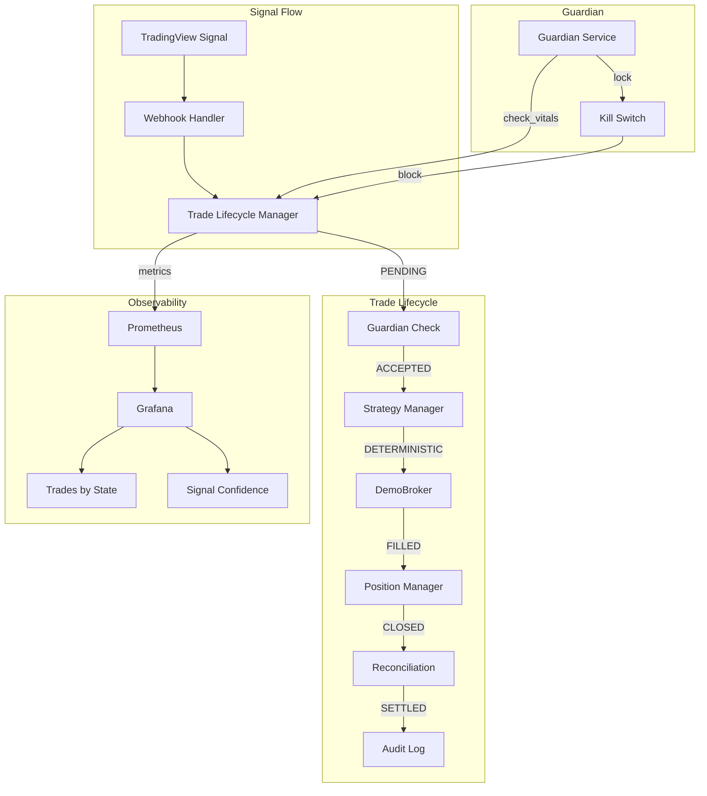

# Design Document: Phase 2 Hard Requirements

## Overview

This design implements the mandatory prerequisites for live trading: trade lifecycle state management, deterministic strategy mode, and verified Guardian kill-switch functionality. These components ensure auditability, reproducibility, and safety before real capital is at risk.

## Architecture



## Components and Interfaces

### 1. Trade Lifecycle Manager

**File:** `services/trade_lifecycle.py`

```python
class TradeState(Enum):
    PENDING = "PENDING"
    ACCEPTED = "ACCEPTED"
    FILLED = "FILLED"
    CLOSED = "CLOSED"
    SETTLED = "SETTLED"
    REJECTED = "REJECTED"  # Terminal state for failed trades

class TradeLifecycleManager:
    """
    Manages trade state transitions with PostgreSQL persistence.
    
    Valid Transitions:
        PENDING → ACCEPTED (Guardian approval)
        PENDING → REJECTED (Guardian denial, validation failure)
        ACCEPTED → FILLED (Broker confirmation)
        ACCEPTED → REJECTED (Broker rejects order)
        FILLED → CLOSED (Position closed)
        CLOSED → SETTLED (P&L reconciled)
        
    Terminal States: SETTLED, REJECTED (no further transitions)
    Invalid transitions are rejected with error logging.
    """
    
    VALID_TRANSITIONS = {
        TradeState.PENDING: [TradeState.ACCEPTED, TradeState.REJECTED],
        TradeState.ACCEPTED: [TradeState.FILLED, TradeState.REJECTED],
        TradeState.FILLED: [TradeState.CLOSED],
        TradeState.CLOSED: [TradeState.SETTLED],
        TradeState.SETTLED: [],  # Terminal
        TradeState.REJECTED: [],  # Terminal
    }
    
    def create_trade(correlation_id: str, signal: Dict) -> Trade
    def transition(trade_id: str, new_state: TradeState, correlation_id: str) -> bool
    def get_trade_state(trade_id: str) -> TradeState
    def get_trades_by_state(state: TradeState) -> List[Trade]
```

### 2. Strategy Manager (Deterministic Mode)

**File:** `services/strategy_manager.py`

```python
class StrategyMode(Enum):
    DETERMINISTIC = "DETERMINISTIC"
    STOCHASTIC = "STOCHASTIC"

class StrategyManager:
    """
    Executes trading strategy with optional deterministic mode.
    
    DETERMINISTIC mode:
        - No random number generation
        - All inputs logged before processing
        - All outputs logged after processing
        - Same inputs → same outputs (reproducible)
    """
    
    def __init__(self, mode: StrategyMode = StrategyMode.DETERMINISTIC)
    def evaluate(self, signal: Dict, market_data: Dict, correlation_id: str) -> StrategyDecision
    def _log_inputs(self, inputs: Dict, correlation_id: str) -> None
    def _log_outputs(self, outputs: Dict, correlation_id: str) -> None
```

### 3. Guardian Kill-Switch Integration

**File:** `services/guardian_service.py` (existing, enhanced)

The Guardian already implements the kill-switch. This design adds:
- Integration with Trade Lifecycle Manager to block trades when locked
- Prometheus metrics for lock status
- Grafana dashboard panels

### 4. Database Schema Extension

**File:** `database/migrations/022_trade_lifecycle_states.sql`

```sql
-- Trade lifecycle state tracking
CREATE TABLE IF NOT EXISTS trade_lifecycle (
    id BIGSERIAL PRIMARY KEY,
    trade_id UUID NOT NULL UNIQUE,
    correlation_id UUID NOT NULL,
    current_state VARCHAR(20) NOT NULL DEFAULT 'PENDING',
    signal_data JSONB NOT NULL,
    created_at TIMESTAMPTZ NOT NULL DEFAULT NOW(),
    updated_at TIMESTAMPTZ NOT NULL DEFAULT NOW(),
    row_hash CHAR(64) NOT NULL,
    
    CONSTRAINT trade_lifecycle_state_check 
        CHECK (current_state IN ('PENDING', 'ACCEPTED', 'FILLED', 'CLOSED', 'SETTLED', 'REJECTED'))
);

-- State transition history (immutable audit log)
CREATE TABLE IF NOT EXISTS trade_state_transitions (
    id BIGSERIAL PRIMARY KEY,
    trade_id UUID NOT NULL,
    from_state VARCHAR(20) NOT NULL,
    to_state VARCHAR(20) NOT NULL,
    correlation_id UUID NOT NULL,
    transitioned_at TIMESTAMPTZ NOT NULL DEFAULT NOW(),
    row_hash CHAR(64) NOT NULL,
    
    -- Idempotency: Prevent duplicate transitions to same state
    CONSTRAINT trade_state_transitions_idempotency
        UNIQUE (trade_id, to_state),
    
    CONSTRAINT trade_state_transitions_trade_fk
        FOREIGN KEY (trade_id) REFERENCES trade_lifecycle(trade_id)
);

-- Strategy decision persistence for replay/debugging
CREATE TABLE IF NOT EXISTS strategy_decisions (
    id BIGSERIAL PRIMARY KEY,
    trade_id UUID NOT NULL,
    correlation_id UUID NOT NULL,
    inputs_hash CHAR(64) NOT NULL,
    outputs_hash CHAR(64) NOT NULL,
    action VARCHAR(10) NOT NULL,
    signal_confidence DECIMAL(5,4) NOT NULL,
    decided_at TIMESTAMPTZ NOT NULL DEFAULT NOW(),
    row_hash CHAR(64) NOT NULL,
    
    CONSTRAINT strategy_decisions_action_check
        CHECK (action IN ('BUY', 'SELL', 'HOLD')),
    
    CONSTRAINT strategy_decisions_trade_fk
        FOREIGN KEY (trade_id) REFERENCES trade_lifecycle(trade_id)
);

-- DB-level transition validation trigger
CREATE OR REPLACE FUNCTION validate_state_transition()
RETURNS TRIGGER
LANGUAGE plpgsql
AS $$
BEGIN
    -- Validate transition is allowed
    IF NOT (
        (NEW.from_state = 'PENDING' AND NEW.to_state IN ('ACCEPTED', 'REJECTED')) OR
        (NEW.from_state = 'ACCEPTED' AND NEW.to_state IN ('FILLED', 'REJECTED')) OR
        (NEW.from_state = 'FILLED' AND NEW.to_state = 'CLOSED') OR
        (NEW.from_state = 'CLOSED' AND NEW.to_state = 'SETTLED')
    ) THEN
        RAISE EXCEPTION 'Invalid state transition: % -> %', NEW.from_state, NEW.to_state;
    END IF;
    
    RETURN NEW;
END;
$$;

CREATE TRIGGER trg_validate_state_transition
    BEFORE INSERT ON trade_state_transitions
    FOR EACH ROW
    EXECUTE FUNCTION validate_state_transition();
```

## Data Models

### Trade

```python
@dataclass
class Trade:
    trade_id: str
    correlation_id: str
    current_state: TradeState
    signal_data: Dict[str, Any]
    created_at: datetime
    updated_at: datetime

@dataclass
class StateTransition:
    trade_id: str
    from_state: TradeState
    to_state: TradeState
    correlation_id: str
    transitioned_at: datetime

@dataclass
class StrategyDecision:
    trade_id: str
    correlation_id: str
    inputs_hash: str
    outputs_hash: str
    action: str  # BUY, SELL, HOLD
    signal_confidence: Decimal
    decided_at: datetime
```

## Correctness Properties

*A property is a characteristic or behavior that should hold true across all valid executions of a system-essentially, a formal statement about what the system should do. Properties serve as the bridge between human-readable specifications and machine-verifiable correctness guarantees.*

### Property 1: Trade Creation Initializes PENDING State
*For any* valid trade signal, when a trade is created, the initial state SHALL be PENDING.
**Validates: Requirements 1.1**

### Property 2: Valid State Transitions Only
*For any* trade and any state transition attempt, the transition SHALL succeed if and only if it follows the valid transition graph (PENDING→ACCEPTED/REJECTED, ACCEPTED→FILLED/REJECTED, FILLED→CLOSED, CLOSED→SETTLED).
**Validates: Requirements 1.2, 1.3, 1.4, 1.5, 1.7**

### Property 3: State Transition Persistence
*For any* successful state transition, the database SHALL contain a record with the transition timestamp and correlation_id.
**Validates: Requirements 1.6**

### Property 4: Transition Idempotency
*For any* trade, attempting the same state transition twice SHALL succeed only once (idempotency via UNIQUE constraint).
**Validates: Requirements 1.6 (webhook retry safety)**

### Property 5: Deterministic Strategy Reproducibility
*For any* set of strategy inputs in DETERMINISTIC mode, executing the strategy twice with identical inputs SHALL produce identical outputs.
**Validates: Requirements 2.4**

### Property 6: Strategy Input/Output Logging
*For any* strategy execution in DETERMINISTIC mode, the logs SHALL contain both the inputs and outputs with correlation_id.
**Validates: Requirements 2.2, 2.3, 2.5**

### Property 7: Strategy Decision Persistence
*For any* strategy decision, the database SHALL contain a record with trade_id, inputs_hash, outputs_hash, action, and signal_confidence.
**Validates: Requirements 2.5**

### Property 8: Guardian Lock Blocks All Trades
*For any* trade request when the Guardian is locked, the request SHALL be rejected immediately.
**Validates: Requirements 3.2, 3.6**

### Property 9: Guardian Lock Persistence
*For any* Guardian lock event, the lock file SHALL contain the lock reason.
**Validates: Requirements 3.4**

## Error Handling

| Error Code | Description | Recovery |
|------------|-------------|----------|
| TLC-001 | Invalid state transition | Log error, reject transition, return False |
| TLC-002 | Trade not found | Log error, return None |
| TLC-003 | Database persistence failure | Log error, raise exception |
| STR-001 | Strategy evaluation failure | Log error, return HOLD decision |
| STR-002 | Non-deterministic operation in DETERMINISTIC mode | Log error, raise exception |

## Testing Strategy

### Property-Based Testing Library
**Library:** Hypothesis (Python)
**Minimum Iterations:** 100 per property

### Unit Tests
- Trade creation with various signal types
- Each valid state transition
- Invalid state transition rejection
- Strategy determinism verification
- Guardian lock integration

### Property-Based Tests
Each correctness property will be implemented as a Hypothesis property test:

1. **Property 1 Test:** Generate random valid signals, create trades, assert state is PENDING
2. **Property 2 Test:** Generate random trades and transitions, verify only valid transitions succeed
3. **Property 3 Test:** Perform transitions, query database, verify records exist
4. **Property 4 Test:** Attempt duplicate transitions, verify only first succeeds
5. **Property 5 Test:** Generate random inputs, run strategy twice, assert outputs match
6. **Property 6 Test:** Run strategy, capture logs, verify inputs/outputs present
7. **Property 7 Test:** Make strategy decisions, query database, verify records exist
8. **Property 8 Test:** Lock Guardian, generate random trade requests, verify all rejected
9. **Property 9 Test:** Trigger lock with random reasons, verify lock file contains reason

### Integration Tests
- End-to-end trade lifecycle flow
- Guardian kill-switch during active trading
- Grafana dashboard data verification
