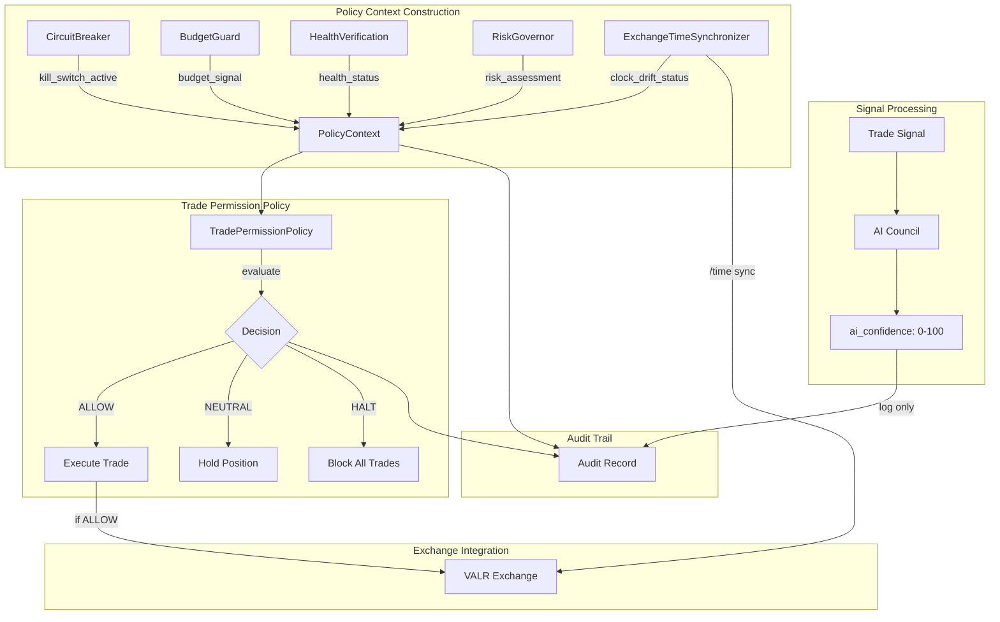

# Design Document: Trade Permission Policy Layer

## Overview

This design implements an Explicit Trade Permission Policy Layer that separates AI confidence (informational) from trade authorization (policy-based). The core principle is that **AI confidence scores NEVER directly authorize trades**. Instead, a deterministic `TradePermissionPolicy` evaluates system state and produces explicit `ALLOW | NEUTRAL | HALT` decisions.

The design also includes:
- **LIVE Trading Runbook**: Human operator documentation for safe production transitions
- **Failure Scenario Simulator**: Tabletop testing framework for validating safety behavior

## Architecture



## Components and Interfaces

### 1. PolicyContext (Data Class)

```python
@dataclass(frozen=True)
class PolicyContext:
    """
    Immutable context for policy evaluation.
    
    Reliability Level: SOVEREIGN TIER
    Input Constraints: All fields required, validated at construction
    Side Effects: None (immutable)
    """
    kill_switch_active: bool
    budget_signal: str  # "ALLOW", "HARD_STOP", "RDS_EXCEEDED", "STALE_DATA"
    health_status: str  # "GREEN", "YELLOW", "RED"
    risk_assessment: str  # "HEALTHY", "WARNING", "CRITICAL"
    correlation_id: str
    timestamp_utc: str
```

### 2. TradePermissionPolicy (Core Module)

```python
# Machine-visible precedence encoding for audit trail
EVALUATION_PRECEDENCE = [
    "KILL_SWITCH",   # Rank 1 - Highest priority
    "BUDGET",        # Rank 2
    "HEALTH",        # Rank 3
    "RISK",          # Rank 4
]

class PolicyReasonCode(Enum):
    """Stable reason codes for dashboards and alerting."""
    ALLOW_ALL_GATES_PASSED = "ALLOW_ALL_GATES_PASSED"
    HALT_KILL_SWITCH = "HALT_KILL_SWITCH"
    HALT_BUDGET_HARD_STOP = "HALT_BUDGET_HARD_STOP"
    HALT_BUDGET_RDS_EXCEEDED = "HALT_BUDGET_RDS_EXCEEDED"
    HALT_BUDGET_STALE_DATA = "HALT_BUDGET_STALE_DATA"
    HALT_RISK_CRITICAL = "HALT_RISK_CRITICAL"
    NEUTRAL_HEALTH_YELLOW = "NEUTRAL_HEALTH_YELLOW"
    NEUTRAL_HEALTH_RED = "NEUTRAL_HEALTH_RED"


class TradePermissionPolicy:
    """
    Deterministic policy evaluator - NEVER uses AI confidence.
    
    Reliability Level: SOVEREIGN TIER
    Input Constraints: Valid PolicyContext
    Side Effects: Logging only
    
    Evaluation Order (short-circuit):
    1. kill_switch_active → HALT
    2. budget_signal != ALLOW → HALT
    3. health_status != GREEN → NEUTRAL
    4. risk_assessment == CRITICAL → HALT
    5. All pass → ALLOW
    
    MONOTONIC SEVERITY (Latch Behavior):
    Once HALT is entered, the system remains in HALT until:
    - Explicit human reset via reset_policy_latch(), OR
    - Full green re-validation window elapses (configurable)
    
    This prevents flapping during:
    - Exchange reconnect storms
    - Partial data recovery
    - Cascading module restarts
    """
    
    def __init__(self, latch_reset_window_seconds: int = 300) -> None:
        self._latched_state: Optional[str] = None
        self._latch_timestamp: Optional[datetime] = None
        self._latch_reset_window = latch_reset_window_seconds
    
    def evaluate(self, context: PolicyContext) -> PolicyDecision:
        """
        Returns PolicyDecision with:
        - decision: 'ALLOW', 'NEUTRAL', 'HALT'
        - reason_code: PolicyReasonCode enum
        - blocking_gate: str (if not ALLOW)
        - precedence_rank: int (1-4)
        """
    
    def reset_policy_latch(self, correlation_id: str, operator_id: str) -> None:
        """Explicit human reset of HALT latch. Requires audit logging."""
    
    def is_latched(self) -> bool:
        """Check if policy is currently latched in HALT state."""
```

### 3. PolicyContextBuilder (Integration Layer)

```python
class PolicyContextBuilder:
    """
    Constructs PolicyContext from authoritative sources.
    
    Reliability Level: SOVEREIGN TIER
    Input Constraints: Valid module references
    Side Effects: Queries external modules
    """
    
    def __init__(
        self,
        circuit_breaker: CircuitBreaker,
        budget_integration: BudgetIntegrationModule,
        health_module: HealthVerificationModule,
        risk_governor: RiskGovernor
    ) -> None: ...
    
    def build(self, correlation_id: str) -> PolicyContext:
        """
        Build context from all sources.
        If any source fails, defaults to most restrictive value.
        """
```

### 4. FailureScenarioSimulator (Testing Framework)

```python
class FailureScenarioSimulator:
    """
    Injects failure conditions for tabletop testing.
    
    Reliability Level: L5 High
    Input Constraints: Valid scenario configuration
    Side Effects: Modifies system state temporarily
    """
    
    def inject_exchange_downtime(self) -> ScenarioResult: ...
    def inject_partial_fill(self, fill_pct: Decimal) -> ScenarioResult: ...
    def inject_stale_market_data(self, age_hours: int) -> ScenarioResult: ...
    def inject_budgetguard_corruption(self) -> ScenarioResult: ...
    def inject_sse_disconnect_storm(self, count: int) -> ScenarioResult: ...
    def inject_exchange_clock_drift(self, drift_ms: int) -> ScenarioResult: ...
```

### 5. ExchangeTimeSynchronizer (Clock Drift Protection)

```python
# Constants
MAX_CLOCK_DRIFT_MS = 1000  # 1 second tolerance
SYNC_INTERVAL_SECONDS = 60  # Sync every minute

class ExchangeTimeSynchronizer:
    """
    Monitors and validates time synchronization with the exchange.
    
    Reliability Level: SOVEREIGN TIER
    Input Constraints: Valid exchange client
    Side Effects: Network I/O, may trigger NEUTRAL state
    
    VALR (like most exchanges) uses timestamped HMAC signing.
    If clock drift exceeds tolerance, requests are silently rejected.
    
    This module:
    - Periodically queries exchange /time endpoint
    - Calculates drift between local and exchange time
    - Triggers NEUTRAL state if drift exceeds MAX_CLOCK_DRIFT_MS
    - Logs drift values for monitoring and alerting
    """
    
    def __init__(
        self,
        exchange_client: Any,
        max_drift_ms: int = MAX_CLOCK_DRIFT_MS,
        sync_interval_seconds: int = SYNC_INTERVAL_SECONDS
    ) -> None:
        self._exchange_client = exchange_client
        self._max_drift_ms = max_drift_ms
        self._sync_interval = sync_interval_seconds
        self._last_drift_ms: Optional[int] = None
        self._drift_exceeded: bool = False
        self._last_sync_timestamp: Optional[datetime] = None
    
    def sync_time(self, correlation_id: str) -> TimeSyncResult:
        """
        Query exchange time and calculate drift.
        
        Returns:
            TimeSyncResult with drift_ms, is_within_tolerance, exchange_time
        """
    
    def is_drift_exceeded(self) -> bool:
        """Check if clock drift currently exceeds tolerance."""
        return self._drift_exceeded
    
    def get_last_drift_ms(self) -> Optional[int]:
        """Get the last measured drift in milliseconds."""
        return self._last_drift_ms
    
    def clear_drift_state(self) -> None:
        """Clear drift exceeded state when drift returns to tolerance."""


@dataclass(frozen=True)
class TimeSyncResult:
    """Result of a time synchronization check."""
    local_time_utc: datetime
    exchange_time_utc: datetime
    drift_ms: int
    is_within_tolerance: bool
    error_code: Optional[str]  # EXCHANGE_TIME_DRIFT or EXCHANGE_TIME_UNAVAILABLE
    correlation_id: str
    timestamp_utc: str
```

## Data Models

### PolicyDecision (Return Type)

```python
@dataclass(frozen=True)
class PolicyDecision:
    """Immutable result from policy evaluation."""
    decision: str  # ALLOW, NEUTRAL, HALT
    reason_code: PolicyReasonCode
    blocking_gate: Optional[str]  # Which gate caused rejection
    precedence_rank: Optional[int]  # 1-4 based on EVALUATION_PRECEDENCE
    is_latched: bool  # True if decision came from latch state
```

### PolicyDecisionRecord (Audit)

```python
@dataclass
class PolicyDecisionRecord:
    """Immutable audit record for policy decisions."""
    correlation_id: str
    timestamp_utc: str
    policy_decision: str  # ALLOW, NEUTRAL, HALT
    reason_code: str  # PolicyReasonCode.value for stable alerting
    blocking_gate: Optional[str]  # Which gate caused rejection
    precedence_rank: Optional[int]  # Machine-visible precedence
    context_snapshot: Dict[str, Any]  # Full PolicyContext as dict
    ai_confidence: Optional[Decimal]  # Logged separately, NOT used in decision
    is_latched: bool  # Whether decision came from monotonic latch
```

### NEUTRAL State Semantics

The NEUTRAL state has explicit semantics:

| Action | Allowed in NEUTRAL |
|--------|-------------------|
| Open new positions | ❌ NO |
| Increase existing positions | ❌ NO |
| Exit existing positions | ✅ YES (exit-only) |
| Reduce position size | ✅ YES |
| Cancel open orders | ✅ YES |
| Manage stop losses | ✅ YES |

**NEUTRAL = No new risk, exit-only allowed**

This is codified in:
- Runbook documentation
- PolicyDecisionRecord
- Execution adapter logic

### ScenarioResult (Testing)

```python
@dataclass
class ScenarioResult:
    """Result of a failure scenario simulation."""
    scenario_id: str
    scenario_type: str
    expected_state: str
    actual_state: str
    assertion_passed: bool
    trades_during_unsafe: int  # Must be 0 for safety
    logs: List[Dict[str, Any]]
    duration_ms: int
```

## Correctness Properties

*A property is a characteristic or behavior that should hold true across all valid executions of a system-essentially, a formal statement about what the system should do. Properties serve as the bridge between human-readable specifications and machine-verifiable correctness guarantees.*

### Property 1: Policy Output Domain
*For any* valid PolicyContext, the TradePermissionPolicy.evaluate() method SHALL return exactly one of the strings "ALLOW", "NEUTRAL", or "HALT".
**Validates: Requirements 1.1**

### Property 2: Kill Switch Supremacy
*For any* PolicyContext where kill_switch_active is True, the TradePermissionPolicy SHALL return "HALT" regardless of all other context values.
**Validates: Requirements 1.2**

### Property 3: Budget Gate Enforcement
*For any* PolicyContext where budget_signal is not "ALLOW" (and kill_switch_active is False), the TradePermissionPolicy SHALL return "HALT".
**Validates: Requirements 1.3**

### Property 4: Health Status Gating
*For any* PolicyContext where kill_switch_active is False, budget_signal is "ALLOW", and health_status is not "GREEN", the TradePermissionPolicy SHALL return "NEUTRAL".
**Validates: Requirements 1.4**

### Property 5: Risk Assessment Gating
*For any* PolicyContext where kill_switch_active is False, budget_signal is "ALLOW", health_status is "GREEN", and risk_assessment is "CRITICAL", the TradePermissionPolicy SHALL return "HALT".
**Validates: Requirements 1.5**

### Property 6: AI Confidence Isolation
*For any* two PolicyContexts that are identical except for associated ai_confidence values, the TradePermissionPolicy SHALL return identical decisions.
**Validates: Requirements 2.2**

### Property 7: Restrictive Default on Source Failure
*For any* PolicyContext construction where one or more sources are unavailable, the resulting context SHALL contain the most restrictive default values (kill_switch_active=True OR budget_signal="HARD_STOP").
**Validates: Requirements 3.5**

### Property 8: Blocking Gate Identification
*For any* policy decision that is not "ALLOW", the logged PolicyDecisionRecord SHALL contain a non-null blocking_gate field identifying which gate caused the rejection.
**Validates: Requirements 4.3**

### Property 9: No Trades During Unsafe Conditions
*For any* failure scenario simulation, the number of trades executed while the system is in an unsafe state (HALT or NEUTRAL) SHALL be exactly zero.
**Validates: Requirements 7.2**

### Property 10: Exchange Downtime Response
*For any* injected exchange_downtime scenario, the system SHALL transition to NEUTRAL state within 5 seconds of injection.
**Validates: Requirements 6.1**

### Property 11: Stale Data Rejection
*For any* injected stale_market_data scenario, all new trade signals SHALL be rejected until fresh data is received.
**Validates: Requirements 6.3**

### Property 12: BudgetGuard Corruption Handling
*For any* injected budgetguard_corruption scenario, the system SHALL enter HALT state and the audit log SHALL contain error code "BUDGET_DATA_CORRUPT".
**Validates: Requirements 6.4**

### Property 13: Policy Supremacy
*For any* system state, no execution path SHALL exist that results in a trade unless TradePermissionPolicy.evaluate() returned "ALLOW" for the associated correlation_id.
**Validates: Requirements 1.1, 2.2**

### Property 14: Monotonic Severity (Latch Behavior)
*For any* sequence of policy evaluations where HALT is returned, subsequent evaluations SHALL continue to return HALT until either an explicit reset_policy_latch() is called OR the latch_reset_window has elapsed with all gates passing.
**Validates: Requirements 1.2 (hardening)**

### Property 15: Exchange Clock Drift Protection
*For any* measured clock drift between local server and exchange server that exceeds 1 second (1000ms), the system SHALL enter NEUTRAL state and log error code "EXCHANGE_TIME_DRIFT".
**Validates: Requirements 9.2**

### Property 16: Clock Drift Recovery
*For any* clock drift that returns to within tolerance (≤1 second), the system SHALL clear the NEUTRAL state and resume normal operation.
**Validates: Requirements 9.3**

## Error Handling

| Error Code | Condition | Action |
|------------|-----------|--------|
| TPP-001 | PolicyContext construction failed | Default to HALT, log error |
| TPP-002 | CircuitBreaker query timeout | Assume kill_switch_active=True |
| TPP-003 | BudgetGuard unavailable | Assume budget_signal="HARD_STOP" |
| TPP-004 | HealthVerification unavailable | Assume health_status="RED" |
| TPP-005 | RiskGovernor unavailable | Assume risk_assessment="CRITICAL" |
| TPP-006 | Exchange clock drift exceeded | Enter NEUTRAL, log EXCHANGE_TIME_DRIFT |
| TPP-007 | Exchange /time endpoint unavailable | Enter NEUTRAL, log EXCHANGE_TIME_UNAVAILABLE |
| FSS-001 | Scenario injection failed | Abort scenario, log failure |
| FSS-002 | Assertion mismatch | Report specific expectation violated |

## Testing Strategy

### Property-Based Testing Framework

The implementation will use **Hypothesis** (Python's property-based testing library) to verify correctness properties. Each property test will run a minimum of 100 iterations with randomly generated inputs.

### Test Annotation Format

Each property-based test MUST be annotated with:
```python
# **Feature: trade-permission-policy, Property {number}: {property_text}**
# **Validates: Requirements X.Y**
```

### Unit Tests

Unit tests will cover:
- PolicyContext construction with valid inputs
- PolicyContext construction with missing/invalid inputs
- Integration points between PolicyContextBuilder and source modules
- Runbook generation section presence
- Audit record structure validation

### Property-Based Tests

Property tests will verify:
1. Output domain (Property 1)
2. Kill switch supremacy (Property 2)
3. Budget gate enforcement (Property 3)
4. Health status gating (Property 4)
5. Risk assessment gating (Property 5)
6. AI confidence isolation (Property 6)
7. Restrictive defaults (Property 7)
8. Blocking gate identification (Property 8)
9. No trades during unsafe (Property 9)
10. Exchange downtime response (Property 10)
11. Stale data rejection (Property 11)
12. BudgetGuard corruption handling (Property 12)
13. Policy supremacy (Property 13)
14. Monotonic severity / latch behavior (Property 14)
15. Exchange clock drift protection (Property 15)
16. Clock drift recovery (Property 16)

### Failure Scenario Tests

Each failure scenario will:
1. Inject the failure condition
2. Assert expected system state
3. Verify NO trades occurred during unsafe conditions
4. Produce structured logs with scenario_id and outcome
